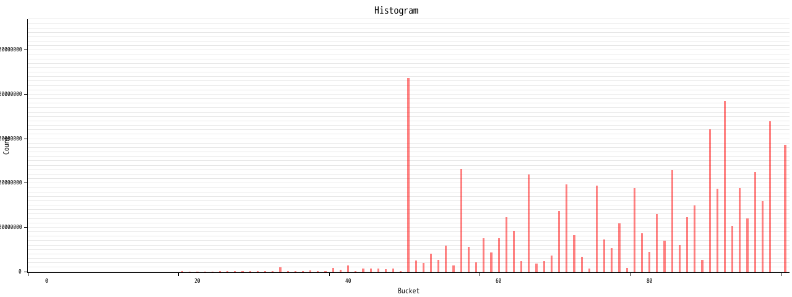

# fasthisto

Visualize histogram ranged (0f64, 1f64). The input should be a text file with one number between 0.0 and 1.0 per line.



### Usage

```bash
cargo build --release
cargo run --release -- output.png number.list
```

`number.list` looks like as follows.

```number.list
0.99
0.234
0.4555
```
